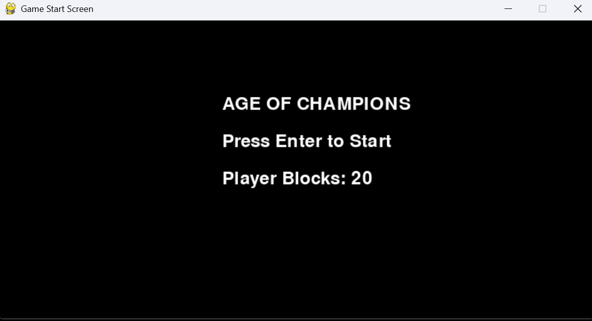
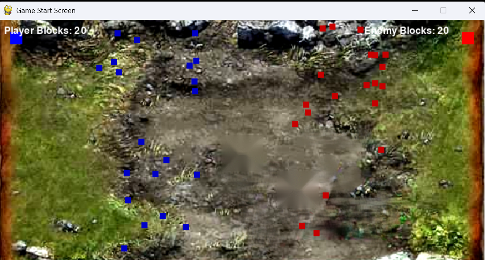
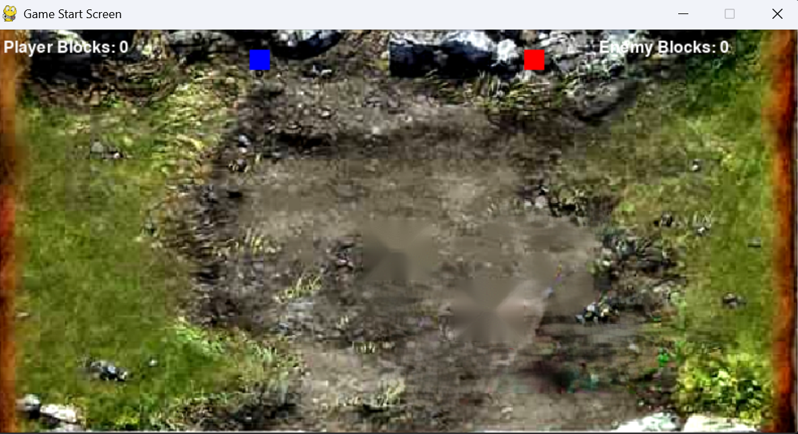
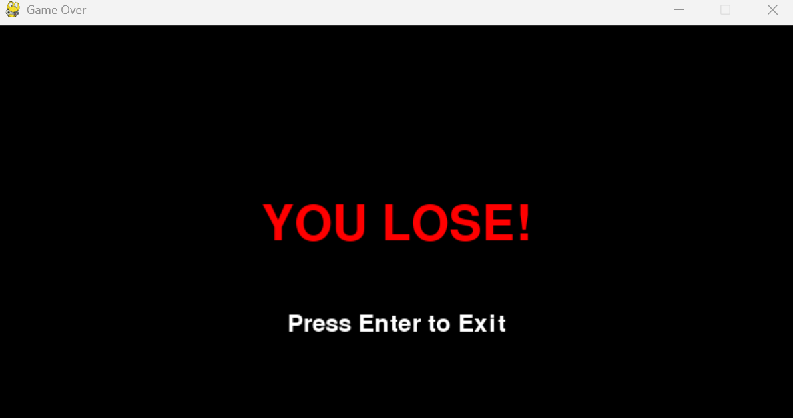
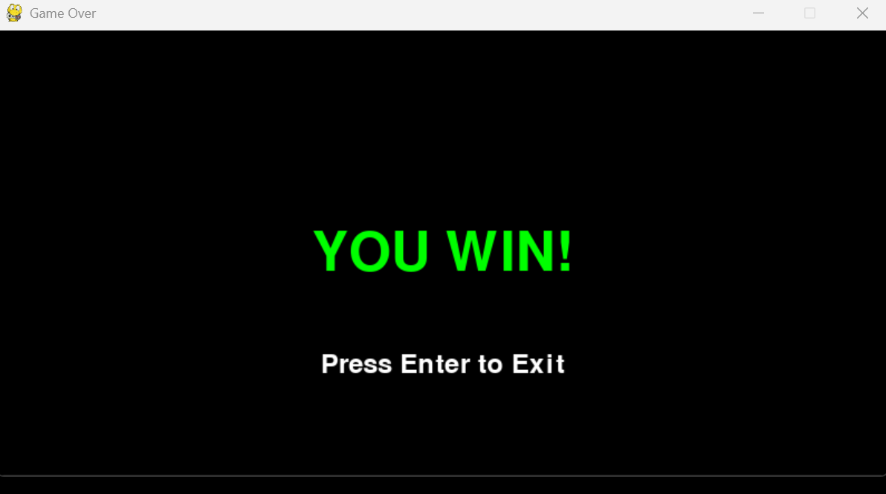

# Age-Of-Blocks

Age of Blocks is a Python-based recreation of the Facebook strategy game "Age of Champions". Built with Pygame, this turn-based tactical game challenges players to command an army of blocks and a powerful "champion" unit in dynamic, automated battles. With real-time collision detection, army management, and strategic movement, the game tests your ability to outmaneuver and eliminate your opponent. Featuring a custom battle background and streamlined visuals, Age of Champions offers a nostalgic yet engaging experience for fans of strategy games and retro aesthetics. Whether you're reliving childhood memories or exploring it for the first time, this project delivers a fun and competitive challenge!

# Please Note

I am no artist and can not or will not create spites and animations for the figures. This is why it is Age of Blocks.

# Features

- 🛡 Real-Time Collision Detection – Blocks dynamically interact and clash, ensuring fair and engaging combat.
- ⚔ Champion vs. Army Mechanics – Normal units can eliminate enemy champions, creating a balanced yet challenging experience.
- 🕹 Retro-Inspired Aesthetics – A nostalgic throwback to classic strategy games with simple yet engaging visuals.

# Technologies Used


# Preview

- Start Screen

- Battle screen

- Hero Battle

- You lose screen

- You win screen


# Directory Structure

```
Age-of-Blocks/
├── __pycache__/                 # Compiled Python files (auto-generated)
├── resources/                   # Resource files (images)
├── Screenshots/                 # Folder for screenshots
├── enemy.py                     # Enemy class and logic
├── game_over.py                 # Game over screen logic
├── main.py                      # Main game logic and entry point
├── player.py                    # Player class and logic
├── start_screen.py              # Start screen logic

```

# Setup Instructions

1. Clone the Repository
git clone https://github.com/your-username/age-of-blocks.git
cd age-of-blocks

2. Install Python
Ensure you have Python 3.8+ installed.
Download Python if needed.

3. Install Dependencies
pip install pygame

4. Run the Game
python main.py

# Future Enhancements

Create open world and allow for more enemy's and progression

# Licensing
This project is licensed under the MIT License.
